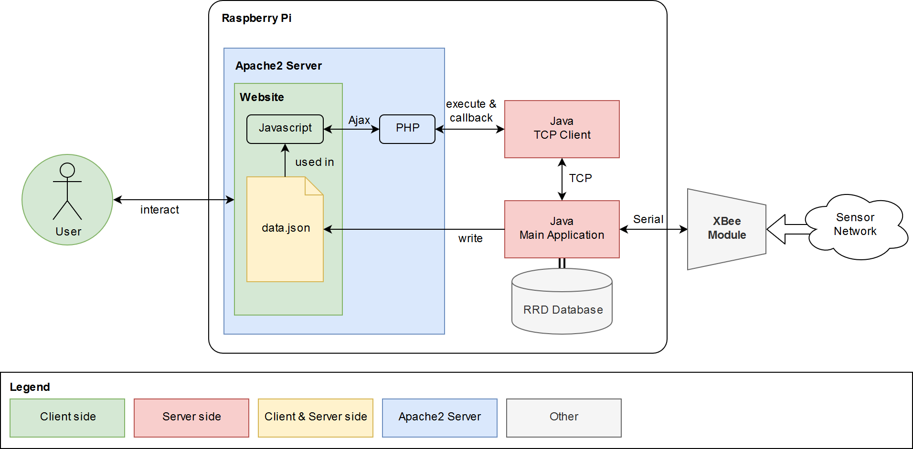
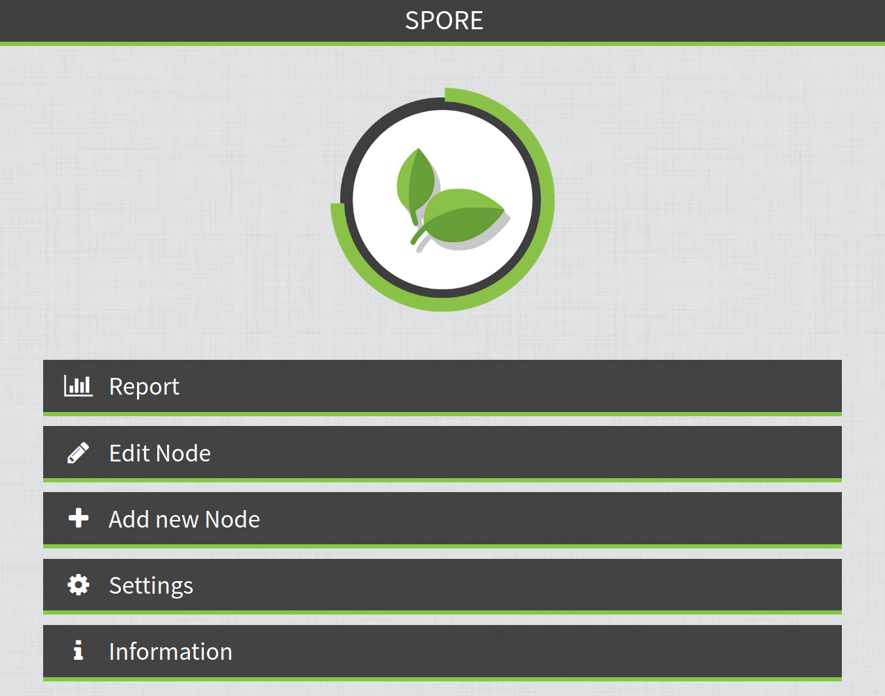
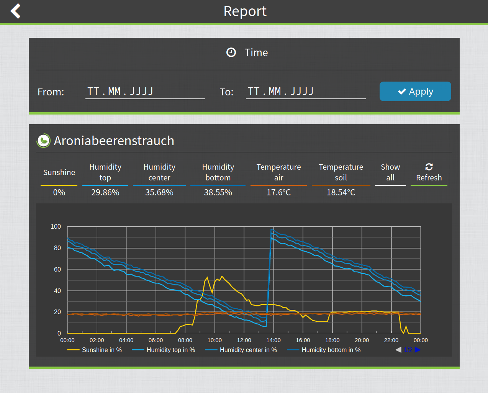
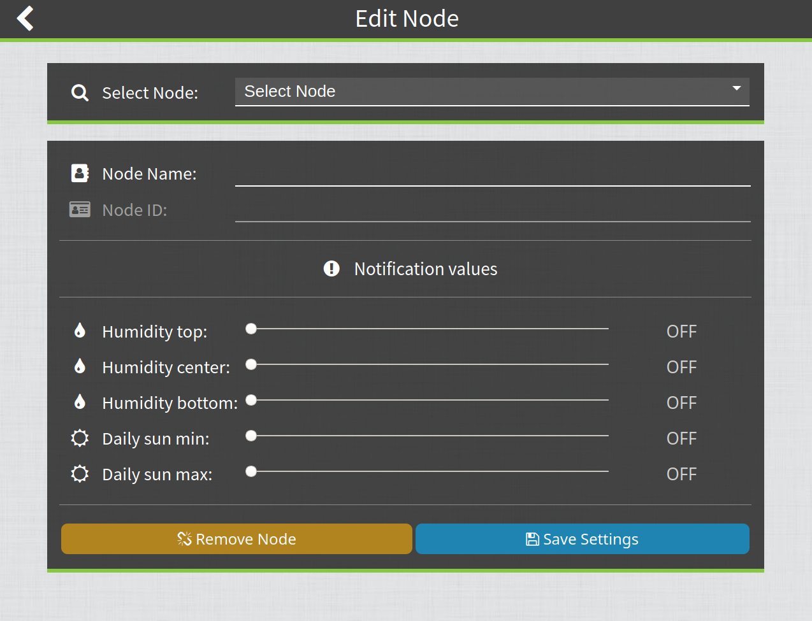

# SPORE (Solar Powered Observing and Reporting Entity)
This repository features a Java program for reading and processing plant sensor measurement data from an XBEE module over the serial interface of the Raspberry Pi. The received data gets stored in an Round Robin Database (RRD) and is displayed in a simple webinterface. When values exceed user defined boundaries the user gets notified.

## Abstract

In the course of the bachelor thesis an XBee based data receiving and processing station for measured values of a sensor measuring network shall be implemented with the help of a Raspberry Pi. The measuring stations take measurements of solar radiation, air temperature, soil temperature and soil humidity in 3 different depths of the soil. The measured values are sent from the solar-powered measuring stations to the Raspberry Pi via XBee modules. The implementation of the measuring stations themselves will take place in two further bachelor theses. The data receiving and processing station stores the measured data in a Round Robin database. Since no app should be developed, the measured values are displayed via graphs in a web-interface. If user-defined limits are exceeded or not reached, the plant owner will be informed by e-mail at a certain time of day which values are outside the limits.

## Communication and storage

## Webinterface for visualizing the data

